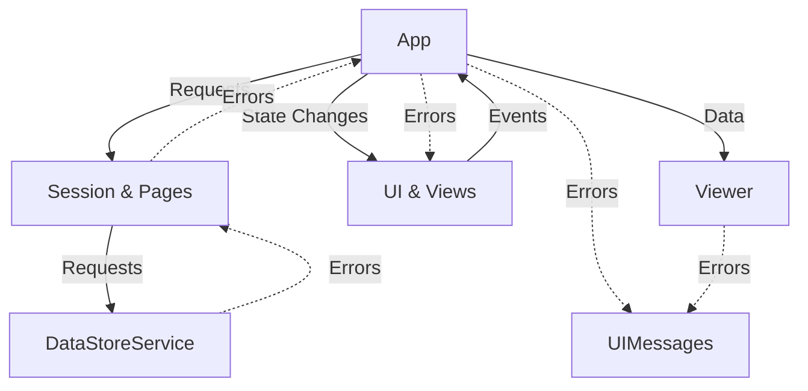

# Building

This project uses Rojo syncback which requires Rojo 7.7.0.

You can install it using [Rokit](https://github.com/rojo-rbx/rokit) which DataDelve uses for its toolchain manager. Once you install Rokit, you can run `rokit install` which will install the right version of Rojo.

With Rojo installed, you can build the plugin with `rojo build plugin.project.json --output datadelve.rbxm`.

You can then import the .rbxm into Studio and then install it as a local plugin.

Alternatively, you can run `rojo build plugin.project.json --project datadelve.rbxm` which will automatically add the plugin to your local plugins folder.

# Syncing

I only edit the plugin studio, so Rojo is only used for syncing with the file system.

To sync, what I do is right click the plugin (in Studio) and press "Save > Save to File". Then I will save it somewhere accessible. A good place is just the repository's folder itself.

Once you have the rbxm saved, run this command `rojo syncback plugin.project.json --input path/to/rbxm.rbxm`.

Now everything should be synced!

## Syncing Alternative

You can also use the `default.project.json` for the traditional Rojo experience.

Make sure to still run syncback if you make changes the gui objects.

# Other tooling

This project does not work with the new type solver.

# Running and writing tests
Most of the testing for DataDelve is done manually, but I have also included some automatic ones for peace of mind.

To run the tests, build the plugin in development mode so the tests are included, then run the plugin. If there are no errors then the tests ran successfuly. To add a test, add a script in the `src/tests` folder and have it error if something goes wrong. Note that tests may be affected by global state such as the settings.

<br>
<hr>
<br>

# Overview of Plugin Structure

The codebase is kind of a mess, but here is a brief overview to help you figure it out.

> Consult this section when necessary.

## Rough diagram of information flow


## Entry Point/App

The entry point is the script called `main`. It interfaces with an `App` object by enabling and disabling it. The `App` object does all the main stuff. Each `App` object has its own ID which is used in case in the future multiple instances of the plugin should be started (like if tab tearing is ever added).

The two apps are currently `App` and `ClientFallbackApp`.

`ClientFallbackApp` appears when the user tries to use the plugin in a play-test on the client.

## DataStore Interface

The main interfaces for DataStores are `Session` and `Pages`. Each app has its own Session object which stores state about what DataStore/key/version is being viewed and is used to send requests.

## UI

The main app creates an instance of the `UI` object. It also creates an instance of the `UIMessages` object. `UIMessages` is used to send toasts and alerts. `UI` sets up the UI and has an assortment of convenience functions for manipulating it. Right now `App` and `UI` are tightly coupled.

### Theming
A `Theme` object contains all the colors used in the UI. It has an event to listen to when the color changes. Every StyleState is passed a `Theme` object so it knows how to style itself. The `Theme` object also contains asset IDs for icons. All icons in the code are slowly being moved into here.

### StyleState
This is what I decided to call my components. StyleStates are objects that wrap around Roblox UI instances with extra state so it knows how to style it. For example, `TextBoxStyleState` has extra state about an errors in the input so it knows to display as red. There is a type definition for StyleStates in `UI.StyleState.StyleStateHelper`. Every StyleState has an `#update(speed)` function which will update the UI based on its state at the given speed using `TweenService`.

> NOTE: If a StyleState is updated multiple times in a single frame, there may be styling errors because `TweenService` will not pick the latest tween to play. All StyleStates should use the `#tween` function in `StyleStateHelper` which will have a fix for this in the future (if I feel like it). You may also see random `task.wait()/task.delay(0, ...)` in the code for this reason. It is quite unfortunate.

When you want to listen to an event on a StyleState, if the underlying object already has that event, it will be in the object which you can access by looking at the source of the StyleState (usually its in a field called `button/textBox/frame`). For example, to see if `ButtonStyleState` was clicked, you do 
```lua
buttonStyleState.button.Activated:Connect(...)
```

If the event is a custom one, it will be in the StyleState:

```lua
checkboxStyleState.toggled:Connect(...)
```

StyleStates do not have a `new` function. You have to construct them from an already existing UI object using `from`. Most of the new StyleStates have types so you know what the UI object should be like, but the old one's don't, so you'll just have to figure it out.

### StyleState Tree
> NOTE: When accessing/passing around a UI object, try to access/pass it from it's StyleState. This is because you can get the object from the StyleState, but you can't get the StyleState from the object.

When working with StyleStates, I usually put them into a tree to reflect the structure of the UI. In the `UI` ModuleScript you will see a giant tree called `styleStates`. It's where I instantiated most of my StyleStates so I can access them easily. When the theme is changed, the UI object will traverse this tree and call `#update("slow")` on them. A consequence of this is that StyleStates outside the main UI tree will not update when the theme is updated. You can wrap an isolated StyleState tree with the `UI.StyleState.StyleStateWrapper` object to make sure it follows the theme.

### Utility StyleStates
`UI.StyleState.Utilities` contains some utility StyleStates. These don't go in any trees because they are usually only used for modals or short-lived UI effects (loading bar, skeleton effect).

### Viewers
Viewers are used to view JSON data. Every `App` has exactly one (this will change once tabs are added).

### Views
You can see there some module scripts that end in `View` inside `UI` (e.g `VersionsView`, `OrderedDataStoreView`). This is when the `UI` ModuleScript was getting too big, and I decided to stop adding to it. They are basically their only mini `UI`, but only concerned with a single part of the UI.

## Assets
In `UI` there is a folder called `Assets` which has all the Gui objects used by the `UI` object. Other scripts may have their own assets stored within as well. It is really haphazard.

## Settings
Settings contains global state for all the settings the user configured.

# Conclusion
This is just a brief overview of how I structured the plugin. If you have any questions you can't figure out, feel free to send me a message on the Roblox DevForum!
